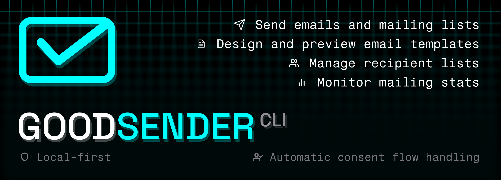

## Features

- 🛡️ Local-first.
  - Email contents, custom templates, recipient groups and sender identities are stored only on your machine.
- ✉️ Send emails in **plain text**, **HTML** or **Markdown** to one or more recipients.
- ✅ Send **consentless** transactional emails using built-in templates (OTP, MFA, Order Completion, etc.)
- 🤝 Automatic consent flow handling.
  - Recipients added via MCP receive the consent email.
  - Emails are queued locally until recipient grants the consent to receive them.
- 📝 Create, edit and store custom templates with dynamic variables.
  - Interactive template previews for quick design iteration.
  - Send test email to verify template rendering.
- 👥 Organize recipients into groups and reference them all by group name.
- 🏷️ Manage sender identities (`From:` header) and reference them by name.
- 📊 Monitor email health metrics.
- 📰 Maintain the blog: settings, custom domain, drafts, publish, preview, and email broadcast.

## Installation

**macOS / Linux**
```sh
curl -fsSL https://raw.githubusercontent.com/good-sender/cli/main/install.sh | sh
```

**Windows** (PowerShell)
```powershell
irm https://raw.githubusercontent.com/good-sender/cli/main/install.ps1 | iex
```

> [!NOTE]
> This will install the CLI binary from the latest release of [`good-sender/mcp`](https://github.com/good-sender/mcp/releases/latest) (*CLI is a thin wrapper around the MCP server) and add it to your PATH (`~/.local/bin` on Unix, `%LOCALAPPDATA%\goodsender\bin` on Windows) making `goodsender` command available in your terminal. Restart your terminal to start using the CLI after installation.
>
> To upgrade to the latest version, run the installation script again and re-run the `goodsender` command.

## Examples

<details>
  <summary><b>Example prompts</b></summary>

  #### Add 'John Doe &lt;john.doe@example.com&gt;' and 'Jane Doe &lt;jane.doe@example.com&gt;' to the AI newsletter subscribers group
  > ℹ️ This will:
  > - Create/update the recipients in the database
  > - Add them to the "AI newsletter subscribers" recipient group, creating it if needed

  #### Create a GoodSender template for a weekly AI news digest sent to the AI newsletter subscribers group
  > ℹ️ This will:
  > - Create a draft email template in GoodSender format following best practices for email template creation
  > - Display interactive preview of this template draft (if AI client supports it)

  #### Increase the number of news in the digest to 5
  > ℹ️ Done during the template draft creation/editing, this will:
  > - Modify the template accordingly
  > - Display interactive preview of this template draft (if AI client supports it)

  #### Send a test email to me: 'Good Sender &lt;good.sender@example.com&gt;'
  > ℹ️ Done during the template draft creation/editing, this will:
  > - Send an email with mocked data generated from the current template draft only to you

  #### Save the template as "Weekly AI news"
  > ℹ️ Done during the template draft creation/editing, this will:
  > - Convert the current template draft to a persistent template stored in the local database
  > - Allow sending emails just by mentioning the template name

  #### Gather this week's AI news and send them using the "Weekly AI news" template
  > ℹ️ This will:
  > - Create and enqueue a a personalized template-based email for each recipient in the AI newsletter subscribers group
  > - For all recipients who haven't received an email with consent request, will request their consent for receiving emails from you
  > - Send emails to all recipients who granted their email consent
  > - Monitor all recipients with pending consent and send the email as soon as they grant it

</details>

## Telemetry & privacy

Telemetry is enabled by default. CLI sends aggregate usage and reliability metrics to GoodSender to help improve the product.

Typical signals include:
- CLI tool names, call counts, and latency.
- Success and error rates.
- Short error excerpts on failures.
- Background job error codes and frequency.

We do **not** intentionally collect email bodies, recipient addresses, or template contents as part of this telemetry.

You can **opt out** of telemetry collection by setting `GOODSENDER_TELEMETRY=false` in the MCP server environment.

See the **[GoodSender Privacy Policy](https://joylabs.com/legal/privacy-policy)** for how personal data is handled by the service.
